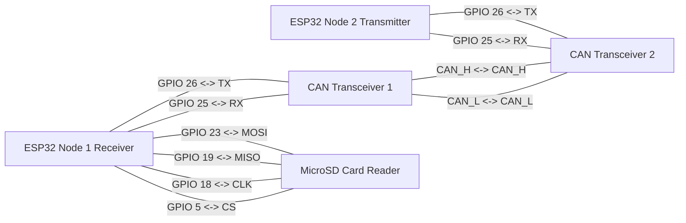

# pwrinspace_zadanie_1

```mermaid
graph LR
    ESP1[ESP32 Node 1 Receiver]
    ESP2[ESP32 Node 2 Transmitter]
    CAN1[CAN Transceiver 1]
    CAN2[CAN Transceiver 2]
    SD[MicroSD Card Reader]

    ESP1 -- "GPIO 26 <-> TX" --- CAN1
    ESP1 -- "GPIO 25 <-> RX" --- CAN1

    ESP1 -- "GPIO 23 <-> MOSI" --- SD
    ESP1 -- "GPIO 19 <-> MISO" --- SD
    ESP1 -- "GPIO 18 <-> CLK" --- SD
    ESP1 -- "GPIO 5 <-> CS" --- SD

    ESP2 -- "GPIO 26 <-> TX" --- CAN2
    ESP2 -- "GPIO 25 <-> RX" --- CAN2

    CAN1 -- "CAN_H <-> CAN_H" --- CAN2
    CAN1 -- "CAN_L <-> CAN_L" --- CAN2
```
