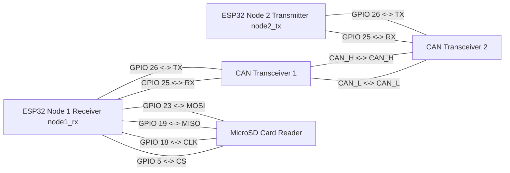

# pwrinspace_zadanie_1

Projekt składa się z 2 modułów dla dwóch układów ESP32. Dlaczego są dwa? Uznałem, że będzie to doskonała praktyka w pracy z magistralą CAN przed drugim zadaniem, a ponieważ realizowałem to zadanie na rzeczywistym sprzęcie, nie będę musiał przebudowywać stanowiska testowego.

Schemat połączeń modułów:

Tak to wyglądało na żywo :)

## node1_rx
### can_receive_task
Nasłuchuje magistralę CAN i czeka na nadejście danych. Składa je z 3 wiadomości w jedną i przesyła do kolejki. Jestem zmuszony korzystać z 3 wiadomości ze względu na ograniczenie protokołu CAN, w którym ładunek użyteczny nie może przekraczać 8 bajtów.

### sd_write_task
Otwiera plik do zapisu danych. Czeka na dane z kolejki z zadania can_receive_task. Zapisuje dane w pamięci RAM i wymusza ich synchronizację z kartą SD co 100 pakietów, aby uniknąć zawieszeń magistrali przy wolnym zapisie.

## node2_tx
Wykonuje dwa główne zadania:

Prosta symulacja lotu rakiety.
Przygotowanie i wysyłka wiadomości przy użyciu interfejsu CAN.

### Symulacja lotu
Składa się z 5 stanów: **STATE_IDLE**, **STATE_BOOST**, **STATE_COAST**, **STATE_DESCENT**, **STATE_LANDED**.
W zależności od tego, w jakim stanie znajduje się rakieta, wysyłane są różne dane, takie jak: _timestamp_, _packet_id_, _chamber_pressure_, _tank_pressure_, _accel_z_, _altitude_.
Ogólnie symulacja lotu wygląda następująco:

Dodatkowo w stanach STATE_IDLE i STATE_LANDED częstotliwość próbkowania telemetrii wynosi 1 Hz, co ma na celu zmniejszenie obciążenia magistrali. W stanach BOOST, COAST, DESCENT częstotliwość wzrasta do 50 Hz.

### Wysyłka wiadomości
Ze względu na ograniczenia protokołu CAN, w którym nie możemy wysłać więcej niż 8 bajtów ładunku użytecznego, musiałem podzielić wiadomości na 3 części, z których każda zawiera po 2 pola. Każda wiadomość ma swój identyfikator (ID), dzięki któremu odbiornik wie, co się w niej znajduje.

## Odpowiedź na pytanie: 
**Q**: Zastanów się, jak to obejść, by nie gubić danych – szczególnie jeśli zwiększymy częstotliwość próbkowania do chociażby 1000 Hz. 
**A**: W takim przypadku moglibyśmy wykorzystać 2 bufory: Bufor A zapisuje dane, a gdy tylko się zapełni, dane zaczyna zapisywać Bufor B. W tym czasie Bufor A przesyła dane na kartę SD. Krótko mówiąc, stosujemy mechanizm Ping-Pong Buffer.

